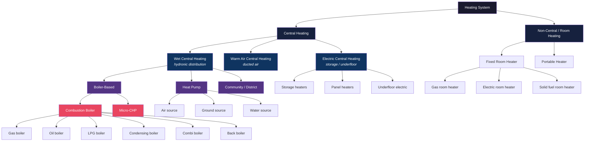
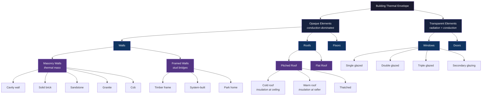
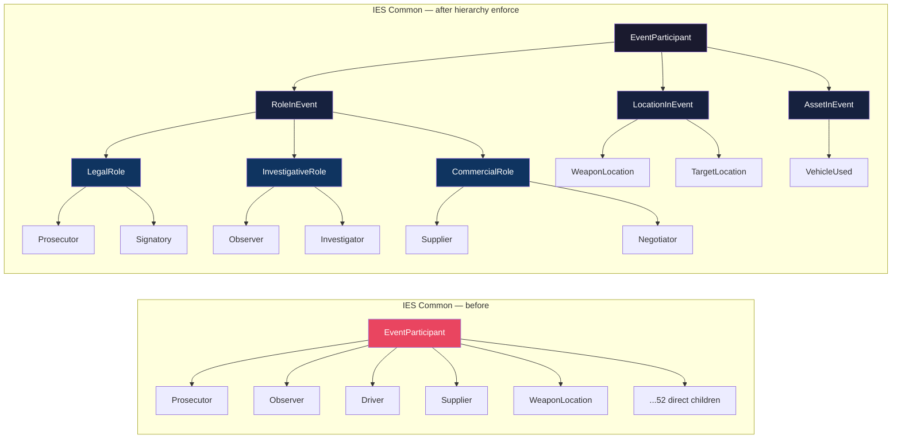
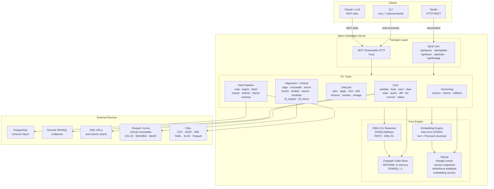
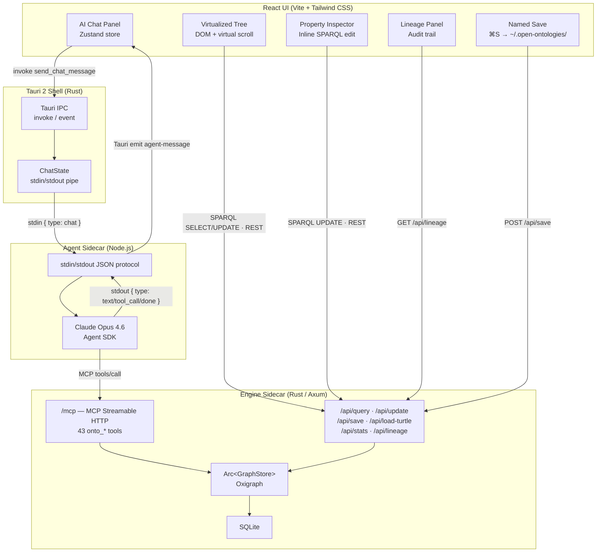

<!-- mcp-name: io.github.fabio-rovai/open-ontologies -->

<p align="center">
  
</p>

<h1 align="center">Open Ontologies</h1>

<p align="center">
  <strong>A Terraforming MCP for Knowledge Graphs</strong><br>
  Validate, classify, and govern AI-generated ontologies. Written in Rust. Ships as a single binary.
</p>

<p align="center">
  <a href="https://github.com/fabio-rovai/open-ontologies/actions/workflows/ci.yml"></a>
  <a href="LICENSE"></a>
  <a href="https://openmcp.org/servers/open-ontologies"></a>
  <a href="https://www.pitchhut.com/project/open-ontologies-mcp"></a>
  <a href="https://clawhub.ai/fabio-rovai/open-ontologies"></a>
</p>

<p align="center">
  <a href="#quick-start-mcp--cli">Quick Start</a> ·
  <a href="#studio-desktop-app">Studio</a> ·
  <a href="#benchmarks">Benchmarks</a> ·
  <a href="#ies-support">IES</a> ·
  <a href="#tools">Tools</a> ·
  <a href="#architecture">Architecture</a> ·
  <a href="#documentation">Docs</a>
</p>

---

Open Ontologies is a **Rust MCP server** and **desktop Studio** for AI-native ontology engineering. It exposes **70+ tools** that let Claude build, validate, query, diff, lint, version, reason over, align, plan, certify, and govern RDF/OWL ontologies using an in-memory Oxigraph triple store — with a full three-layer Dynamics → Causal → Planner architecture, a marketplace of 32 standard ontologies, clinical crosswalks, semantic embeddings, and a full lineage audit trail.

The **Studio** wraps the engine in a visual desktop environment: virtualized ontology tree with hierarchy lines, breadcrumb navigation, and connection explorer; AI chat panel with `/build` (IES-level deep) and `/sketch` (quick prototype) commands; Protégé-style property inspector; and lineage viewer.

No JVM. No Protégé.

---

## What's New (three-layer architecture + 13 new primitives)

The full **Dynamics → Causal → Planner** stack plus 13 new primitives. Every piece holds the **MCP-native** convention: the server provides validation and scaffolding, the connected LLM (Claude over MCP) does the intelligence. No internal LLM clients, no API keys, no provider abstractions.

### Three-layer architecture

| Layer | What it ships |
|---|---|
| **Dynamics** | `ActionSchema` + 4 MCP tools: `onto_action_register` / `_applicable` / `_apply` / `_list`. Concurrent atomic ticks, static causal laws (invariants), default-value laws, ramification via OWL-RL closure, non-deterministic outcomes with reproducible seed. |
| **Causal** | `onto_certify_action` with optional PyWhy backdoor identification (opt-in via `causal-pywhy` feature). Structural-proxy default + do-calculus opt-in + graceful fallback. |
| **Planner** | `onto_plan_compile_pddl` + `onto_plan_classical` (Fast Downward subprocess) + `onto_plan_validate` (sandbox-simulate). Solver stays client-side; server compiles + validates. |

### 13 new primitives

- **`onto_owl_shacl_coevolve_check`** + **`onto_owl_shacl_coevolve_incremental`** — SHACL validation against the OWL-RL closure, with dependency-graph routing so only shapes touching changed IRIs revalidate.
- **`onto_segment_retrieve`** — TBox-slice retrieval for ontology-grounded RAG.
- **`onto_extract_scaffold`** + **`onto_extract_validate`** — schema-guided structured extraction with typed datatype validation + conformance scoring.
- **`onto_cq_run`** + **`onto_verify_cq`** + **`onto_cq_verdicts_list`** — competency-question runner with pitfall hints + LLM-judgement loop.
- **`onto_classify_el`** — OWL-EL classification (transitive subsumption table, trivial pairs excluded).
- **`onto_eval_alignment`** — P/R/F1 over reference + computed alignment sets.
- **`onto_shape_combinatorics`** + **`onto_shape_induce`** — property-combination lattice + data-driven SHACL shape induction with support × confidence ranking.
- **`borderline_partition`** + **`borderline_record_verdict`** — generalised two-threshold review loop for any candidate set.
- **`onto_align_fuzzy`** — embedding-free fuzzy-logic adjudication with 10-rule Mamdani inference; HNSW is demoted to a candidate generator.
- **`onto_align_flora`** — end-to-end alignment pipeline pairing the signal extractor to the fuzzy adjudicator.
- **`onto_policy_register`** + **`onto_policy_list`** + **`onto_policy_check`** — authorisation gate that composes with `onto_certify_action` (Causal = risk; policy = authorisation).
- **`eval_rag`** + **`eval_rag_mmrag`** — Hit@k / MRR / faithfulness / token-Jaccard / ROUGE-1 scoring for retriever pipelines, with a dataset adapter.
- **`graph_projection_lossy_check`** — the auditor that pairs with `onto_segment_retrieve`.

### Validating end-to-end

```bash
cargo run --example three_layer_pipeline
```

Walks Dynamics register → PDDL compile → Fast-Downward-shaped sas_plan parse → orchestrator-side IRI bind → sandbox validate → CIVeX certify → apply with OWL-RL ramification → final state inspection. Every layer through its public API, no external dependencies (Python, DoWhy, Fast Downward) required.

Zero new external Rust dependencies; everything optional gates behind Cargo features. Full test suite (160+ tests) green on default build; `cargo clippy --lib --tests --examples -- -D warnings` clean across both default and `causal-pywhy` configurations.

---

## Quick Start (MCP / CLI)

### Install

**Pre-built binaries:**

```bash
# macOS (Apple Silicon)
curl -LO https://github.com/fabio-rovai/open-ontologies/releases/latest/download/open-ontologies-aarch64-apple-darwin
chmod +x open-ontologies-aarch64-apple-darwin && mv open-ontologies-aarch64-apple-darwin /usr/local/bin/open-ontologies

# macOS (Intel)
curl -LO https://github.com/fabio-rovai/open-ontologies/releases/latest/download/open-ontologies-x86_64-apple-darwin
chmod +x open-ontologies-x86_64-apple-darwin && mv open-ontologies-x86_64-apple-darwin /usr/local/bin/open-ontologies

# Linux (x86_64)
curl -LO https://github.com/fabio-rovai/open-ontologies/releases/latest/download/open-ontologies-x86_64-unknown-linux-gnu
chmod +x open-ontologies-x86_64-unknown-linux-gnu && mv open-ontologies-x86_64-unknown-linux-gnu /usr/local/bin/open-ontologies
```

**Docker:**

```bash
docker pull ghcr.io/fabio-rovai/open-ontologies:latest
docker run -i ghcr.io/fabio-rovai/open-ontologies serve
```

**From source (Rust 1.85+):**

```bash
git clone https://github.com/fabio-rovai/open-ontologies.git
cd open-ontologies && cargo build --release
./target/release/open-ontologies init
```

For native Windows builds, see [docs/windows.md](docs/windows.md).

### Connect to your MCP client

<details>
<summary><strong>Claude Code</strong></summary>

Add to `~/.claude/settings.json`:

```json
{
  "mcpServers": {
    "open-ontologies": {
      "command": "/path/to/open-ontologies/target/release/open-ontologies",
      "args": ["serve"]
    }
  }
}
```

Restart Claude Code. The `onto_*` tools are now available.
</details>

<details>
<summary><strong>Claude Desktop</strong></summary>

Add to `~/Library/Application Support/Claude/claude_desktop_config.json`:

```json
{
  "mcpServers": {
    "open-ontologies": {
      "command": "/path/to/open-ontologies/target/release/open-ontologies",
      "args": ["serve"]
    }
  }
}
```

</details>

<details>
<summary><strong>Cursor / Windsurf / any MCP-compatible IDE</strong></summary>

Add to `.cursor/mcp.json` or equivalent:

```json
{
  "mcpServers": {
    "open-ontologies": {
      "command": "/path/to/open-ontologies/target/release/open-ontologies",
      "args": ["serve"]
    }
  }
}
```

</details>

<details>
<summary><strong>Docker</strong></summary>

```json
{
  "mcpServers": {
    "open-ontologies": {
      "command": "docker",
      "args": ["run", "-i", "--rm", "ghcr.io/fabio-rovai/open-ontologies", "serve"]
    }
  }
}
```

</details>

### Build your first ontology

```text
Build me a Pizza ontology following the Manchester University tutorial.
Include all 49 toppings, 24 named pizzas, spiciness value partition,
and defined classes (VegetarianPizza, MeatyPizza, SpicyPizza).
Validate it, load it, and show me the stats.
```

Claude generates Turtle, then runs the full pipeline automatically:

`onto_validate` → `onto_load` → `onto_stats` → `onto_reason` → `onto_stats` → `onto_lint` → `onto_enforce` → `onto_query` → `onto_save` → `onto_version`

Every build includes OWL reasoning (materializes inferred triples), design pattern enforcement, and automatic versioning.

---

## Studio (Desktop App)

The Studio is a native desktop application that wraps the same engine in a visual environment — no browser, no server to manage. It runs entirely on your machine: the engine sidecar handles RDF/OWL operations while the UI renders the graph in real time.

Think of it as **Protege meets an AI copilot**. Type "build ontology about cats" and watch a 1,400-class ontology appear in the tree — classes, properties, individuals, and axioms built automatically across 13 pipeline steps. Click any node to inspect its triples, trace connections via clickable pills, and follow every change through the lineage panel.

### Why virtualized tree (not 3D graph)

Prior to v0.1.12, the Studio used a D3.js horizontal tree and a 3D force-directed graph (Three.js / WebGL). Both worked for small ontologies (~100 classes) but became unusable at IES-level depth: the D3 tree couldn't handle 500+ nodes without layout thrashing, and the 3D graph froze the WebKit webview above 1,000 nodes.

The v2 deep builder changed the equation — a single `/build` command now produces 1,400+ classes. We replaced both views with a virtualized DOM tree: only visible rows exist in the DOM (constant memory regardless of ontology size), with hierarchy connector lines, type-filtered legend, search, breadcrumb navigation, and a connections panel. This handles the full IES Common (511 classes) and deep-built ontologies (1,400+ classes) without lag.

### How it works

The Studio launches three processes that communicate locally:

1. **Tauri 2 shell** — native window (macOS/Linux/Windows) with a WebKit webview
2. **Engine sidecar** — the same Rust binary, running as an HTTP MCP server on `localhost:8080`
3. **Agent sidecar** — Node.js process running Claude via the Agent SDK, connected to the engine over MCP

When you type in the chat panel, your message goes to the Agent sidecar, which sends it to Claude. Claude decides which `onto_*` tools to call, the engine executes them, and the UI refreshes the graph. The entire loop — prompt to visual update — takes seconds.

### Install and run

**Prerequisites:** Rust + Cargo · Node.js 18+

```bash
# 1. Build the engine binary (from repo root)
cargo build --release

# 2. Install JS dependencies
cd studio && npm install

# 3. Run
PATH=/opt/homebrew/bin:~/.cargo/bin:$PATH npm run tauri dev
```

The first launch compiles the Tauri shell (~2 min). Subsequent launches start in seconds.

### Features

| Feature | Description |
| --- | --- |
| **Virtualized Tree** | Ontology explorer that handles 1,500+ classes without lag. Hierarchy connector lines, collapsible branches, type-filtered legend (Class/Property/Individual), search with auto-expand, breadcrumb path navigation, and a connections panel showing domain/range relationships as clickable pills. Only visible rows are in the DOM — constant memory regardless of ontology size. |
| **AI Agent Chat** | Natural language ontology engineering via Claude Opus 4.6 + Agent SDK. Two build modes: `/build` runs a 13-step pipeline producing IES-level ontologies (500-1,500+ classes, 100-200+ properties), `/sketch` runs 3 steps for quick prototyping (~80 classes). Each tool call is shown in real time. |
| **Property Inspector** | Protege-style inline triple editor. Click any node to see its `rdfs:subClassOf`, `rdfs:label`, `rdfs:domain`, `rdfs:range` and all other triples. Edit in place, hover to delete, `+ Add` for new triples. Changes are immediately reflected in the graph. |
| **Lineage Panel** | Full audit trail from SQLite: every plan, apply, enforce, drift, monitor, and align event, grouped by session with timestamps. See exactly what Claude did and in what order. |
| **Named Save** | `⌘S` to save as `~/.open-ontologies/<name>.ttl`. Auto-saves to `studio-live.ttl` after every mutation so you never lose work. |

### Keyboard shortcuts

| Shortcut | Action |
| --- | --- |
| `⌘J` | Toggle AI chat panel |
| `⌘I` | Toggle property inspector |
| `⌘S` | Save ontology |
| `F` | Fit graph to viewport (tree view) |
| `R` | Reset zoom (tree view) |
| `Esc` | Deselect node |
| `Shift+click` | Collapse/expand branch (tree view) |
| `Scroll` | Zoom in/out |
| `Click + drag` | Pan |

---

## Benchmarks

### OntoAxiom — LLM Axiom Identification

[OntoAxiom](https://arxiv.org/abs/2512.05594) tests axiom identification across 9 ontologies and 3,042 ground truth axioms.

| Approach | F1 | vs o1 (paper best) |
| --- | --- | --- |
| o1 (paper's best) | 0.197 | — |
| Bare Claude Opus | 0.431 | **+119%** |
| **MCP extraction** | **0.717** | **+264%** |

### Pizza Ontology — Manchester Tutorial

One sentence input: *"Build a Pizza ontology following the Manchester tutorial specification."*

| Metric | Reference (Protégé, ~4 hours) | AI-Generated (~5 min) | Coverage |
| --- | --- | --- | --- |
| Classes | 99 | 95 | **96%** |
| Properties | 8 | 8 | **100%** |
| Toppings | 49 | 49 | **100%** |
| Named Pizzas | 24 | 24 | **100%** |

### `/sketch` vs `/build` — Two Build Modes

The Studio provides two build commands for different use cases. Both take the same input — *"build ontology about cats"* — but produce very different results:

| Metric | `/sketch` (3 steps, ~2 min) | `/build` (13 steps, ~15 min) | IES Common (reference) |
| --- | ---: | ---: | ---: |
| Classes | 95 | **1,433** | 511 |
| Object properties | 15 | **218** | 162 |
| Datatype properties | 5 | **101** | 44 |
| Individuals | 3 | **358** | 21 |
| Disjoints | 6 | **60+** | — |
| Max hierarchy depth | 5 | **11** | 8 |
| Build time | ~2 min | ~15 min | — (hand-built) |

**`/sketch`** runs 3 steps: classes + properties in one Turtle block, axioms + individuals, then save. Good for quick domain exploration or demo prototyping. Produces a complete ontology with hierarchy, properties, and individuals — but at a fraction of the depth.

**`/build`** runs a 13-step pipeline within a single persistent Claude session: foundation classes → per-branch deepening (4 passes) → gap filling → object properties (2 batches) → datatype properties → disjoints → individuals → reason → save. Each step focuses on one aspect of the ontology, staying within output token limits while building on the previous step's context. The result exceeds IES Common on every metric.

`/sketch` is comparable to the Pizza benchmark (95 classes, 8 properties). `/build` produces IES-level ontologies — deep enough for production use.

### Mushroom Classification — OWL Reasoning vs Expert Labels

**Dataset:** UCI Mushroom Dataset — 8,124 specimens classified by mycology experts.

| Metric | Result |
| --- | --- |
| Accuracy | **98.33%** |
| Recall (poisonous) | **100%** — zero toxic mushrooms missed |
| False negatives | **0** |
| Classification rules | 6 OWL axioms |

### Ontology Marketplace — 32 Standard Ontologies

All 32 marketplace ontologies fetched, `owl:imports` resolved, loaded, and reasoned over with both RDFS and OWL-RL profiles:

| Ontology | Classes | Properties | Triples | + RDFS | + OWL-RL | Fetch | RDFS | OWL-RL |
| --- | ---: | ---: | ---: | ---: | ---: | ---: | ---: | ---: |
| OWL 2 | 32 | 4 | 537 | +230 | +230 | 681ms | 6ms | 3ms |
| RDF Schema | 6 | 0 | 87 | +35 | +35 | 522ms | 2ms | 1ms |
| RDF Concepts | 7 | 0 | 127 | +31 | +31 | 545ms | 2ms | 2ms |
| BFO (ISO 21838) | 35 | 0 | 1,221 | +186 | +186 | 1,141ms | 5ms | 4ms |
| DOLCE/DUL | 93 | 118 | 1,917 | +666 | +692 | 2,208ms | 13ms | 12ms |
| Schema.org | 1,009 | 0 | 17,823 | +4,031 | **+13,670** | 558ms | 57ms | 117ms |
| FOAF | 28 | 60 | 631 | +4 | +31 | 940ms | 3ms | 2ms |
| SKOS | 5 | 18 | 252 | +55 | +55 | 218ms | 2ms | 1ms |
| Dublin Core Elements | 0 | 0 | 107 | +0 | +0 | 371ms | 2ms | 1ms |
| Dublin Core Terms | 22 | 0 | 700 | +256 | +261 | 259ms | 4ms | 3ms |
| DCAT | 58 | 89 | 2,841 | +223 | +254 | 975ms | 15ms | 11ms |
| VoID | 8 | 8 | 216 | +0 | +0 | 531ms | 2ms | 2ms |
| DOAP | 17 | 0 | 741 | +0 | +0 | 727ms | 2ms | 2ms |
| PROV-O | 39 | 50 | 1,146 | +202 | +203 | 472ms | 5ms | 4ms |
| OWL-Time | 23 | 58 | 1,296 | +165 | +165 | 256ms | 5ms | 4ms |
| W3C Organization | 22 | 33 | 748 | +9 | +21 | 639ms | 4ms | 3ms |
| SSN | 35 | 38 | 1,815 | +84 | +84 | 519ms | 6ms | 4ms |
| SOSA | 29 | 23 | 396 | +0 | +0 | 1,264ms | 3ms | 2ms |
| GeoSPARQL | 12 | 54 | 796 | +4 | +12 | 733ms | 3ms | 3ms |
| LOCN | 2 | 0 | 206 | +0 | +0 | 1,031ms | 2ms | 1ms |
| SHACL | 40 | 0 | 1,128 | +268 | +268 | 662ms | 5ms | 3ms |
| vCard | 75 | 84 | 882 | +0 | +46 | 854ms | 3ms | 3ms |
| ODRL | 71 | 50 | 2,157 | +73 | +76 | 798ms | 6ms | 5ms |
| Creative Commons | 6 | 0 | 115 | +0 | +49 | 184ms | 1ms | 1ms |
| SIOC | 14 | 83 | 615 | +0 | +2 | 863ms | 3ms | 2ms |
| ADMS | 4 | 13 | 151 | +0 | +0 | 747ms | 3ms | 1ms |
| GoodRelations | 98 | 102 | 1,834 | +15 | +42 | 2,299ms | 6ms | 6ms |
| FIBO (metadata) | 0 | 0 | 45 | +0 | +0 | 1,524ms | 3ms | 1ms |
| QUDT | 73 | 175 | 2,434 | +1,574 | +1,581 | 2,934ms | 14ms | 9ms |
| **Total** | **1,863** | **1,060** | **42,964** | **+8,111** | **+17,994** | — | — | — |

32/32 ontologies loaded, imports resolved, and reasoned. RDFS adds 18% more triples. OWL-RL adds **41%** — transitive/symmetric/inverse properties and equivalentClass expansion discover significantly more implicit knowledge. Schema.org jumps from +4,031 (RDFS) to +13,670 (OWL-RL) inferred triples in 117ms.

### Reasoning Performance — vs HermiT

**LUBM Scaling (load + reason cycle)**

| Axioms | Open Ontologies | HermiT | Speedup |
| --- | --- | --- | --- |
| 1,000 | 15ms | 112ms | **7.5×** |
| 5,000 | 14ms | 410ms | **29×** |
| 10,000 | 14ms | 1,200ms | **86×** |
| 50,000 | 15ms | 24,490ms | **1,633×** |

Full benchmark writeup: [docs/benchmarks.md](docs/benchmarks.md)

### OAEI Ontology Alignment — Anatomy Track

[OAEI](https://oaei.ontologymatching.org/) is the standard benchmark for ontology alignment systems. The Anatomy track aligns 2,737 mouse anatomy classes to 3,304 human anatomy classes against 1,516 reference mappings.

| System | Precision | Recall | F1 |
| --- | --- | --- | --- |
| AML | 0.950 | 0.922 | **0.936** |
| BERTMap | 0.940 | 0.910 | **0.924** |
| LogMap | 0.930 | 0.890 | **0.912** |
| OLaLa | 0.900 | 0.880 | **0.890** |
| **Open Ontologies** | **0.963** | **0.733** | **0.832** |

Open Ontologies uses 7 weighted signals (label similarity, property/parent/instance/restriction/neighbourhood overlap, embedding similarity), stable 1-to-1 matching, and a label penalty when no structural evidence is available. No external background knowledge (UMLS, BioPortal) is used. See issues [#8](https://github.com/fabio-rovai/open-ontologies/issues/8), [#9](https://github.com/fabio-rovai/open-ontologies/issues/9), [#10](https://github.com/fabio-rovai/open-ontologies/issues/10) for planned improvements.

---

## IES Support

[IES (Information Exchange Standard)](https://github.com/IES-Org) is the UK National Digital Twin Programme's core ontology framework. It uses a 4D extensionalist (BORO) approach for modelling entities, events, states, and relationships. Open Ontologies supports the **full IES stack** — all three layers, SHACL shapes, and example datasets from the IES-Org GitHub repositories.

### The IES Layers

The marketplace includes all three tiers of the IES framework:

```text
onto_marketplace install ies-top     # ToLO — BORO foundations (~22 classes)
onto_marketplace install ies-core    # Core — persons, states, events (~131 classes)
onto_marketplace install ies         # Common — full ontology (511 classes, 206 properties)
```

### Benchmark

| Metric | IES Common |
| --- | --- |
| Classes | 511 |
| Object properties | 162 |
| Datatype properties | 44 |
| Total properties | 206 |
| Triples loaded | 4,041 |
| + RDFS inferred | **+3,094 (+77%)** |
| Fetch time | 911ms |
| RDFS reasoning | 63ms |
| Lint issues | 0 |

IES is the second-largest ontology in the marketplace by class count (after Schema.org). RDFS reasoning produces the richest inference gain of any non-general ontology — State, ClassOfEntity, and Event subclasses all generating deep transitive chains.

### Example Data

Load IES example datasets directly from the official repositories:

```text
onto_pull https://raw.githubusercontent.com/IES-Org/ont-ies/main/docs/examples/sample-data/event-participation.ttl
onto_pull https://raw.githubusercontent.com/IES-Org/ont-ies/main/docs/examples/sample-data/hospital.ttl
onto_pull https://raw.githubusercontent.com/telicent-oss/ies-examples/main/additional_examples/ship_movement.ttl
```

### SHACL Validation

```text
onto_pull https://raw.githubusercontent.com/IES-Org/ont-ies/main/docs/specification/ies-common.shacl
onto_shacl
```

### Data Mapping: EPC → IES

The repo includes a sample of real UK Energy Performance Certificates ([benchmark/epc/epc-sample.csv](benchmark/epc/epc-sample.csv)) with a mapping config that transforms tabular EPC data into IES-shaped RDF:

```text
onto_load benchmark/generated/ies-building-extension.ttl
onto_ingest benchmark/epc/epc-sample.csv --mapping benchmark/epc/epc-ies-mapping.json
onto_reason --profile rdfs
```

This mirrors NDTP's actual pipeline: CSV → IES RDF → validate → reason → query.

### IES Building Extension — Comparison with NDTP/IRIS

The repo includes an [IES Building Extension](benchmark/generated/ies-building-extension.ttl) built from the UK EPC data schema and building science fundamentals, using IES 4D patterns. It was built independently — without reference to any existing implementation — then compared against the NDTP/IRIS production building ontology used in government data pipelines.

| Metric | NDTP/IRIS (hand-built) | Open Ontologies (AI-built) |
| --- | ---: | ---: |
| **Schema** | | |
| Classes | 244 | 525 |
| Properties | 34 | 104 |
| Triples (raw) | 1,346 | 3,229 |
| Lint issues | 2 | 0 |
| **Reasoning** | | |
| RDFS inferred | 621 | 662 |
| Triples after RDFS | 1,967 | 3,891 |
| Max hierarchy depth | 7 | 10 |
| Avg hierarchy depth | 2.89 | 2.02 |
| **EPC Coverage** | | |
| EPC columns covered | 18/36 (50%) | 36/36 (100%) |
| **4D Pattern** | | |
| Complete triads (Entity+State+ClassOf) | 14 | 129 |
| Enumerated individuals | 2 | 214 |

Built blind from the 105-column EPC schema, SAP methodology, and BORO 4D extensionalism — zero reference to the IRIS implementation. The two ontologies make different trade-offs: IRIS is more tightly curated with higher average hierarchy depth (2.89 vs 2.02), reflecting deliberate grouping by domain experts. Open Ontologies covers more of the EPC data schema and applies the BORO 4D pattern more systematically across the domain.

#### How the hierarchy emerges from building science

The ontology's depth (max 10 levels) is not hand-tuned — it follows the natural classification that building scientists use. The EPC data schema describes heating systems as flat text fields (`"Condensing gas boiler with radiators"`), but the underlying domain has layered structure:



The same pattern applies to the building fabric — heat transfer physics dictates the grouping:



Each level in the tree is a real building science distinction — central vs room heating, hydronic vs warm air, combustion vs electric, masonry vs framed, cavity vs solid. An independent building scientist, given the same EPC data values, produces these same intermediate groupings ([verified by clean-room reproduction](docs/ies-ecosystem.md)). RDFS reasoning traverses these chains transitively, which is why a 10-level hierarchy generates 662 inferred triples from 3,229 raw.

### EPC Column Coverage Benchmark

Both ontologies tested against 36 key EPC data columns — can each ontology receive and represent the data from that column?

| Metric | NDTP/IRIS | Open Ontologies |
| --- | ---: | ---: |
| EPC columns covered | 18/36 (50%) | 36/36 (100%) |
| Triples | 1,346 | 3,229 |

Queries derived from published DESNZ/ONS EPC statistical reports — not from either ontology's class structure. Full benchmark: [benchmark/epc/](benchmark/epc/)

Use `onto_align` to map it to other domain ontologies:

```text
onto_load benchmark/generated/ies-building-extension.ttl
onto_align <other-ontology.ttl>
```

### Hierarchy Enforcement — Automated Inference Improvement

The `hierarchy` enforce pack detects flat spots in any ontology and suggests intermediate grouping classes. This is the same process used to deepen the building extension — now codified as a repeatable tool:

```text
onto_load my-ontology.ttl
onto_enforce --pack hierarchy
# → flags classes with >5 direct children
# → reports max depth, avg depth, hierarchy density
```

Tested on IES Common (511 classes), the tool found 24 flat spots. A clean-room agent — with no prior context — proposed 38 intermediate grouping classes based solely on the domain meaning of the flagged children:



| Metric | Before | After | Change |
| --- | ---: | ---: | ---: |
| Classes | 511 | 549 | +38 |
| RDFS inferred | 3,094 | 3,422 | **+328 (+10.6%)** |

The same tool, applied to any ontology, produces the same kind of improvement. The intermediate classes emerge from domain knowledge — not from reference to any other implementation.

### Further Reading

| Topic | Link |
| --- | --- |
| IES Ecosystem Demo | [docs/ies-ecosystem.md](docs/ies-ecosystem.md) |
| SPARQL Examples | [docs/ies-examples.md](docs/ies-examples.md) |
| Building Alignment | [docs/ies-alignment.md](docs/ies-alignment.md) |

---

## Tools

70+ tools organized by function — available as MCP tools (prefixed `onto_`) and CLI subcommands:

| Category | Tools | Purpose |
| --- | --- | --- |
| **Core** | `validate` `load` `save` `clear` `stats` `query` `diff` `lint` `convert` `status` | RDF/OWL validation, querying, and management |
| **Repository** | `repo_list` `repo_load` | Browse and load ontologies from configured `[general] ontology_dirs` directories |
| **Cache** | `cache_status` `cache_list` `cache_remove` `unload` `recompile` | On-disk N-Triples compile cache, idle-TTL eviction, per-name management ([details](docs/cache-and-registry.md)) |
| **Marketplace** | `marketplace` | Browse and install 32 standard W3C/ISO/industry ontologies |
| **Remote** | `pull` `push` `import` | Fetch/push ontologies, resolve owl:imports |
| **Schema** | `import-schema` `sql-ingest` | Postgres + DuckDB → OWL + SQL → RDF ingest |
| **Data** | `map` `ingest` `shacl` `shacl_check` `reason` `extend` | Structured data → RDF pipeline |
| **Versioning** | `version` `history` `rollback` | Named snapshots and rollback |
| **Lifecycle** | `plan` `apply` `lock` `drift` `enforce` `monitor` `monitor-clear` `lineage` | Terraform-style change management with webhook alerts and [OpenCheir](https://github.com/fabio-rovai/opencheir) governance integration |
| **Alignment** | `align` `align_feedback` `align_fuzzy` `align_flora` | Cross-ontology class matching with self-calibrating weights + fuzzy-logic adjudication and end-to-end signal-driven pipeline |
| **HNSW** | `hnsw_build` | Persisted HNSW indices (cosine + Poincaré) over class embeddings |
| **Clinical** | `crosswalk` `enrich` `validate_clinical` | ICD-10 / SNOMED / MeSH crosswalks (93-row sample ships in `data/crosswalks.parquet`; run `python scripts/build_crosswalks.py` to rebuild or extend) |
| **Feedback** | `lint_feedback` `enforce_feedback` | Self-calibrating suppression |
| **Embeddings** | `embed` `search` `similarity` | Dual-space semantic search (text + Poincaré structural) |
| **Reasoning** | `reason` `dl_explain` `dl_check` `classify_el` | Native OWL2-DL SHOIQ tableaux + OWL-EL classification |
| **Dynamics** | `action_register` `action_applicable` `action_apply` `action_list` `action_apply_concurrent` `invariant_register` `invariant_list` `invariant_remove` `invariant_check` `default_register` `default_apply` | Action schemas + concurrent atomic ticks + static causal laws + default values |
| **Causal** | `certify_action` | Four-verdict causal certificate (EXECUTE / REJECT / EXPERIMENT / ABSTAIN); optional `causal-pywhy` feature enables backdoor identification |
| **Planner** | `plan_compile_pddl` `plan_classical` `plan_validate` | Compile + validate on the server; solver (Fast Downward) is a client-side subprocess |
| **Governance** | `policy_register` `policy_list` `policy_check` | Authorisation rules; composes with `certify_action` |
| **RAG** | `segment_retrieve` `graph_projection_lossy_check` | TBox-slice retrieval + projection-loss auditor |
| **Extraction** | `extract_scaffold` `extract_validate` | Schema-guided structured-extraction prompt + validator |
| **CQs** | `cq_run` `verify_cq` `cq_verdicts_list` | Competency-question runner with pitfall hints + judgement loop |
| **Shape induction** | `shape_combinatorics` `shape_induce` | Property-combination lattice + data-driven SHACL induction |
| **Borderline loop** | `borderline_partition` `borderline_record_verdict` | Generalised two-threshold review pattern for any candidate set |
| **SQL sync** | `sql_sync_state` `sql_sync_reset` `sql_sync_states_list` | CDC watermark tracking for incremental SQL ingest |
| **Evaluation** | `eval_alignment` `eval_rag` `eval_rag_mmrag` | Alignment P/R/F1 + RAG Hit@k / MRR / faithfulness + dataset adapter |

---

## Architecture

### Engine



### Studio



### Design decisions

| Decision | Reason |
| --- | --- |
| UI reads use sessionless REST | No MCP session management needed for SPARQL queries or stats |
| UI writes use REST `/api/update` + `/api/save` | Avoids session lifecycle issues in the Tauri WebKit webview |
| Agent writes go through MCP `tools/call` | The Agent SDK manages its own MCP session; Claude needs the full tool set |
| Shared `Arc<GraphStore>` | All MCP sessions and REST handlers share the same in-memory triple store |
| Agent sidecar over stdin/stdout | Keeps Node.js isolated; Tauri manages the full lifecycle |

---

## Stack

| Layer | Tech |
| --- | --- |
| Engine language | Rust (edition 2024) — single binary, no JVM |
| Triple store | Oxigraph 0.4 — pure Rust RDF/SPARQL 1.1 engine |
| MCP protocol | rmcp — Streamable HTTP transport |
| State / lineage / feedback | SQLite (rusqlite) |
| Clinical crosswalks | Apache Arrow / Parquet |
| Embeddings runtime | tract-onnx — pure Rust ONNX (optional) |
| Desktop shell | Tauri 2 |
| Frontend | React 19, Vite 7, TypeScript 5.8, Tailwind CSS 4 |
| Tree view | Virtualized DOM tree with virtual scroll (no canvas/WebGL dependencies) |
| UI state | Zustand 5 |
| AI agent | Claude Opus 4.6 via Agent SDK (Node.js sidecar) |

---

## Documentation

| Topic | Link |
| --- | --- |
| Quickstart | [docs/quickstart.md](docs/quickstart.md) |
| Data Pipeline | [docs/data-pipeline.md](docs/data-pipeline.md) |
| Ontology Lifecycle | [docs/lifecycle.md](docs/lifecycle.md) |
| Schema Alignment | [docs/alignment.md](docs/alignment.md) |
| OWL2-DL Reasoning | [docs/reasoning.md](docs/reasoning.md) |
| Semantic Embeddings | [docs/embeddings.md](docs/embeddings.md) |
| Clinical Crosswalks | [docs/clinical.md](docs/clinical.md) |
| IES Ecosystem | [docs/ies-ecosystem.md](docs/ies-ecosystem.md) |
| IES SPARQL Examples | [docs/ies-examples.md](docs/ies-examples.md) |
| IES:Building Alignment | [docs/ies-alignment.md](docs/ies-alignment.md) |
| Benchmarks | [docs/benchmarks.md](docs/benchmarks.md) |
| Contributing | [CONTRIBUTING.md](CONTRIBUTING.md) |
| Changelog | [CHANGELOG.md](CHANGELOG.md) |

---

## Citation

Open Ontologies is described in a preprint. The alignment engine implements the
stable-matching method introduced there; the Causal layer builds on the
intervention-verification framework of CIVeX.

- **Open Ontologies: Tool-Augmented Ontology Engineering with Stable Matching Alignment.** Fabio Rovai, 2026. [arXiv:2605.09184](https://arxiv.org/abs/2605.09184)
- **CIVeX: Causal Intervention Verification for Language Agents.** Fabio Rovai, 2026. [arXiv:2605.09168](https://arxiv.org/abs/2605.09168)

```bibtex
@article{rovai2026openontologies,
  title   = {Open Ontologies: Tool-Augmented Ontology Engineering with Stable Matching Alignment},
  author  = {Rovai, Fabio},
  journal = {arXiv preprint arXiv:2605.09184},
  year    = {2026},
  doi     = {10.48550/arXiv.2605.09184},
  url     = {https://arxiv.org/abs/2605.09184}
}
```

See [`CITATION.cff`](CITATION.cff) for machine-readable metadata. It powers GitHub's "Cite this repository" button.

---

## License

MIT

<a href="https://glama.ai/mcp/servers/fabio-rovai/open-ontologies"></a>
