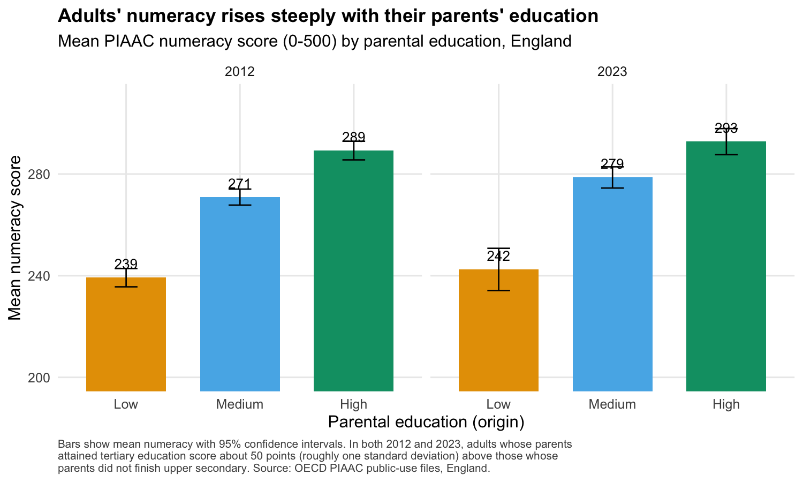
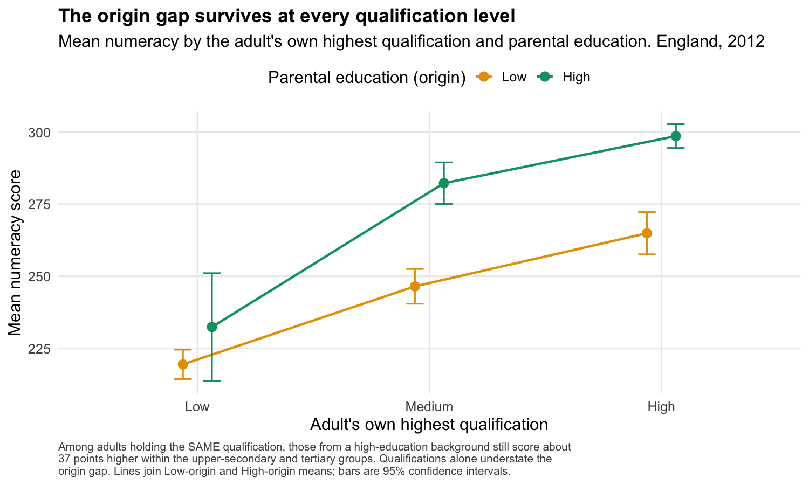
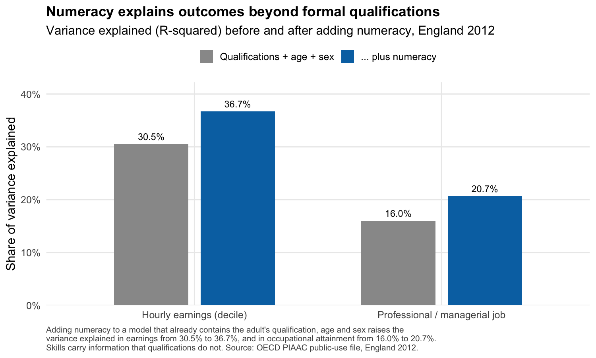
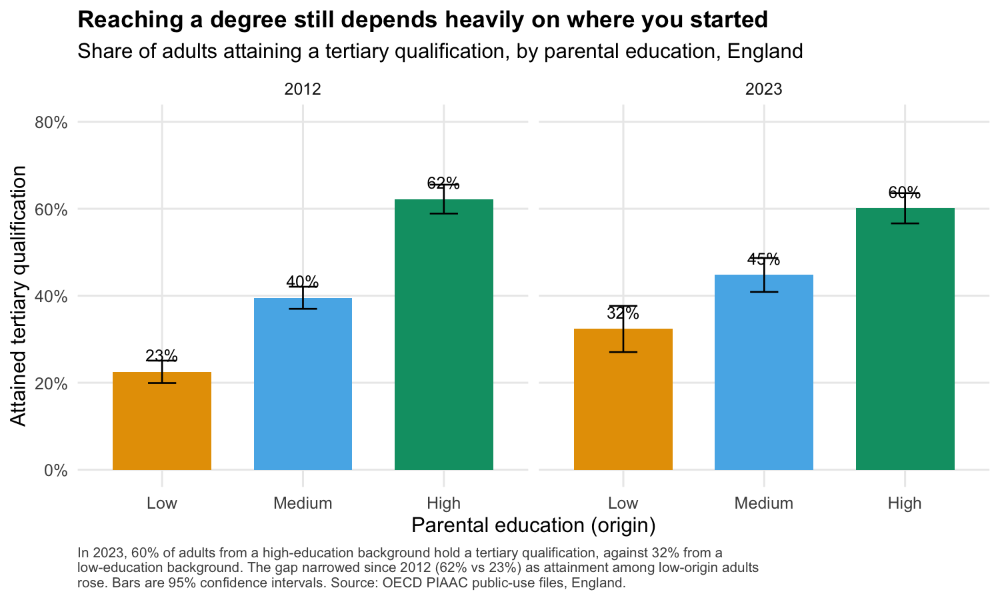

# What adult skills reveal about social mobility that qualifications hide

## The finding, first

In England, a person's numeracy as an adult is still strongly shaped by their parents' education. Adults whose parents reached tertiary education score about 50 points higher on the OECD numeracy scale than adults whose parents did not finish upper secondary school. That is roughly one full standard deviation, the difference between a routine and a confident command of everyday numbers.

The result that matters for policy is narrower and sharper. Hold the qualification fixed, and the origin gap does not close. Among adults who hold the **same** highest qualification, those from a higher educated family still score about 37 points higher in numeracy. Qualifications, the measure most adult-skills and mobility statistics rely on, understate the advantage that family background confers. They are a real ladder, but two people on the same rung are not in the same place.

This case study quantifies that pattern using public, reproducible data, and documents the method openly so others can rerun and challenge it.

## Challenge

The UK has rich administrative data on qualifications and a long-standing policy interest in social mobility, yet most mobility measurement leans on a single destination variable: the qualification a person ends up with. Qualifications are coarse. They tell you the certificate, not the capability behind it, and they are awarded under conditions that vary across decades and institutions.

The Survey of Adult Skills (PIAAC) offers something qualifications cannot: a direct, internationally comparable measure of what adults can actually do with literacy and numeracy, alongside a measure of social origin (parental education). That makes it possible to ask a question qualifications cannot answer on their own. Once you know someone's qualification, does family background still predict their skills and their labour-market position? If it does, qualification-based mobility statistics are measuring the rungs and missing the gaps between them.

The practical obstacles are real. The PIAAC public-use files are large, are released under two different cycles (2012 and 2023) with different variable names and codings, and require correct statistical handling of plausible values and replicate weights. Getting any of that wrong produces confident, wrong numbers. The harmonisation work, not the modelling, is where most analyses quietly fail.

## Intervention

We built a fully reproducible pipeline in R on the genuinely open PIAAC public-use files for England, for both the 2012 (Cycle 1) and 2023 (Cycle 2) surveys. The data are downloaded programmatically from the OECD public file store, with the source URLs, file sizes and access date recorded in a manifest. No restricted or licensed microdata is used.

Three design choices make the analysis trustworthy.

1. **Correct survey statistics throughout.** Proficiency is measured with ten plausible values, combined by Rubin's rules rather than averaged into a single score. Standard errors use the 80 replicate weights with the method appropriate to each cycle (the jackknife in 2012, Fay's balanced repeated replication in 2023). Every estimate carries a 95% confidence interval. We validated the pipeline against the published OECD topline: our England 2023 mean numeracy of 269 matches the published figure of 268, and reproduces the significant rise since 2012 that the OECD reports.

2. **A common origin-to-destination ladder.** Parental education and the respondent's own highest qualification are both placed on the same three bands (below upper secondary, upper secondary, tertiary). This is what lets us compare like with like and ask the "same qualification, different origin" question directly.

3. **An open, documented harmonisation layer.** Reconciling the 2012 and 2023 variables (for example, parental education is `PARED` in one file and `PAREDC2` in the other, and the education categories are coded differently) is exactly the kind of work that usually lives in undocumented script comments. We instead encoded it as a small, machine-readable variable scheme using the **Open Ontologies** platform, our open-source RDF and SPARQL toolchain. Every variable and every coded value is a concept that traces back to its PIAAC source variable, the official OECD value label, and the source file. The scheme is published alongside the analysis as SKOS Turtle and JSON-LD, and is validated by the same Oxigraph engine that powers the platform.

## Outcome

Four results, each descriptive and each with confidence intervals reported in the technical note.

**1. Skills rise steeply with social origin.** In 2023, mean numeracy in England was 242 for adults whose parents did not finish upper secondary, 279 for the middle group, and 293 for those with a tertiary-educated parent. The 2012 gradient was almost identical (239, 271, 289). The advantage of origin is large and stable across a decade.

**2. The advantage is mostly invisible to qualifications.** The raw High-versus-Low origin numeracy gap in 2023 is 47 points. After holding the respondent's own highest qualification constant, 32 points remain (95% confidence interval 22 to 43). About two-thirds of the origin gap is not captured by the qualification a person holds. The 2012 figures tell the same story: a 52-point gap, of which 35 points survive adjustment for qualification.

**3. Among people with the same qualification, origin still predicts skill.** Within the upper-secondary group, adults from higher educated families score 38 points higher in numeracy than their lower-origin peers with the same qualification. Within the tertiary group, 37 points. The gap is real at the very levels of the system that are supposed to equalise.

**4. Skills carry information that qualifications do not.** Adding numeracy to a model that already contains a person's qualification, age and sex raises the share of variance explained in hourly earnings from 30.5% to 36.7%, and in reaching a professional or managerial occupation from 16.0% to 20.7%. Each standard deviation of numeracy is associated with almost a full earnings-decile step up, after qualifications are accounted for. Measuring skills directly tells you something about life chances that the certificate alone does not.

There is one encouraging movement. The share of adults from lower educated families who reach a tertiary qualification rose from 23% in 2012 to 32% in 2023, narrowing the attainment gap with higher-origin adults (still 60%). Access to qualifications has widened. The skills gap behind the qualifications has not.

## Assurance and ethics

- **Open data, no restricted licence.** The analysis uses only the OECD PIAAC public-use files, downloaded from the OECD public file store. The pipeline records the exact URLs, byte sizes and access date.
- **Descriptive, not causal.** Every result is an association. We do not claim that parental education causes the skills gap, only that the two are strongly and persistently related once qualifications are held constant. The technical note states the limitations in full.
- **Comparability stated honestly.** The 2012 UK sample covers England and Northern Ireland; the 2023 sample covers England. All cross-year comparisons restrict 2012 to England so the geography matches. Four-digit occupation and continuous earnings are suppressed in the 2023 public file, so those measures use one-digit occupation and earnings deciles for comparability across years.
- **Accessibility.** Figures use a colourblind-safe palette, large type and descriptive captions that double as alternative text. Every figure ships with the underlying numbers as a CSV.
- **No invented entities.** Each concept in the published variable scheme traces to a documented PIAAC source variable and official value label. The coverage report records 100% provenance.

## Reusable assets

Everything needed to reproduce, audit or extend this work is published with it.

| Asset | What it is |
| --- | --- |
| R pipeline (`R/01`-`04`) | Download, harmonise, analyse and visualise, end to end |
| `lib_piaac.R` | Reusable PIAAC estimators: plausible values by Rubin's rules, cycle-aware replicate-weight variance |
| Variable scheme (`ontology/`) | SKOS Turtle and JSON-LD coded harmonisation of the 2012 and 2023 variables, plus an entity list and coverage report |
| Figure data (`outputs/figures/*.csv`) | The numbers behind every chart |
| Technical note | Full methodology, variable definitions, weighting, and limitations |

The variable scheme is the part most likely to be reused. Any analyst working across the two PIAAC cycles for the UK can take the coded crosswalk and skip the most error-prone step. That is the point of doing the harmonisation in the open, as data, rather than burying it in a script.

## Method and reproducibility

The full method, including the plausible-value and replicate-weight handling, the validation against published OECD figures, and the limitations, is in the [technical note](technical-note.md). The pipeline runs with four commands and regenerates every number and figure in this case study from the raw open files.

*Source: OECD Programme for the International Assessment of Adult Competencies (PIAAC), public-use files, England, Cycle 1 (2012) and Cycle 2 (2023). Analysis by The Tesseract Academy, June 2026.*
