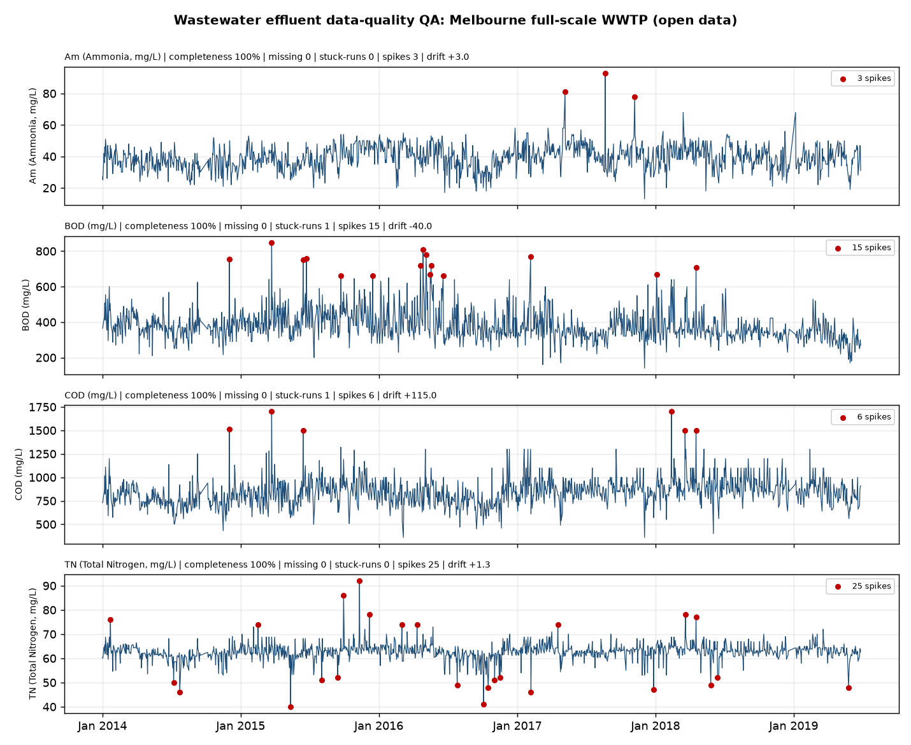

# Case study: wastewater effluent data quality — Open Ontologies

A reproducible, open-data demonstration of how Open Ontologies turns a regulated
wastewater monitoring stream into **trustworthy, machine-validated data**. It pairs
a statistical quality pass over a real full-scale treatment-works dataset with a
declarative SHACL rule set that rejects physically impossible records before they
reach a regulator's intelligence pipeline.

**Why it matters.** Continuous effluent monitoring is only as useful as the data is
trustworthy. Calibration drift, fouled probes, telemetry gaps and transcription
errors all masquerade as real water-quality signals. This case study shows the two
layers that catch them: **statistics** (find the anomalies) and **declarative
validation** (encode the physics so impossible records can never pass).

## The data

`Data-Melbourne_F.csv` — a full-scale wastewater treatment plant, daily records
**2014-01-01 to 2019-06-27 (1,382 days)**, carrying the regulated effluent suite:
ammonia, BOD, COD, total nitrogen, plus average inflow/outflow. Source: Kaggle,
[Full Scale Waste Water Treatment Plant Data](https://www.kaggle.com/datasets/d4rklucif3r/full-scale-waste-water-treatment-plant-data)
(CC BY-SA 4.0). The CSV is fetched by `qa_wwtp.py`.

## Layer 1 — statistical QA (`qa_wwtp.py`)

A robust, reproducible battery: completeness against the daily cadence, stuck-sensor
(flatline) runs, median-absolute-deviation outlier detection (so genuine pollution
events are not masked by their own influence on the threshold), physical-range
checks, and multi-year baseline drift.



Headline findings on this works:

| Determinand | Completeness | Stuck runs | MAD spikes | 5-yr drift |
|---|---|---|---|---|
| Ammonia (mg/L) | 100% | 0 | 3 | +3.0 |
| BOD (mg/L) | 100% | 1 | 15 | −40.0 |
| COD (mg/L) | 100% | 1 | 6 | +115.0 |
| Total N (mg/L) | 100% | 0 | 25 | +1.3 |
| Avg inflow (ML/d) | 100% | 0 | 34 | +1.1 |

The series is complete and internally consistent (the COD ≥ BOD invariant holds on
every one of 1,382 rows — a strong curation signal), but the QA pass still surfaces
genuine structure a trend analyst must handle: dozens of statistical outliers per
determinand and a multi-year COD baseline drift of +115 mg/L that no single-point
range check would catch.

## Layer 2 — declarative validation (SHACL)

- [`effluent-ontology.ttl`](effluent-ontology.ttl) — the observation model (ISO 19156
  / W3C SOSA pattern: one observation, one value per determinand, an assurance state).
- [`effluent-snapshots.ttl`](effluent-snapshots.ttl) — six records: three clean, three
  with a planted fault.
- [`data-quality-shapes.ttl`](data-quality-shapes.ttl) — eight SHACL rules: required
  date, per-determinand non-negative range bands, non-empty record, and two
  **domain-aware cross-parameter rules**.

The load-bearing rule is **R7: COD ≥ BOD**. Chemical Oxygen Demand measures all
oxidisable matter; Biochemical Oxygen Demand only the biodegradable fraction, so by
definition COD can never be below BOD. A record where it is, is physically
impossible and must be rejected — something no per-column range check can see. R8
applies the same idea to flow conservation (outflow should not grossly exceed inflow).

### Run it

```bash
pip install pyshacl rdflib numpy matplotlib
./run-demo.sh
```

Result: the three clean records pass; the three faulty ones each fail on their named
rule:

```
conforms: False
  Focus Node: eff:obs_04   Message: R7: COD must be >= BOD (physically impossible otherwise).
  Focus Node: eff:obs_05   Message: R2: ammonia must be 0-100 mg/L.
  Focus Node: eff:obs_06   Message: R8: average outflow exceeds inflow by more than 50% (meter fault?).
```

## The Open Ontologies point

Classification of "is this data trustworthy?" is **declarative, not learned**. Each
quality rule is a constraint, not a trained model: no labelled fault set, no
retraining when a new failure mode appears — you add a rule. Statistics finds the
anomalies; the ontology and its shapes encode the domain physics that decide which
anomalies are merely unusual and which are impossible. That separation is what makes
the verdict auditable, and auditable data quality is exactly what a regulator needs
before continuous monitoring can carry regulatory weight.

*Built by [Tesseract Academy](https://gov.tesseract.academy). Data CC BY-SA 4.0.*
